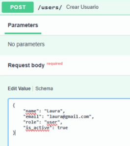
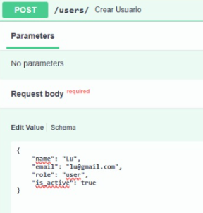
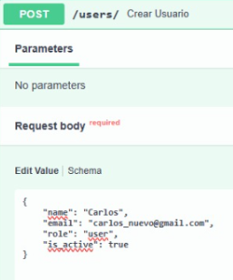
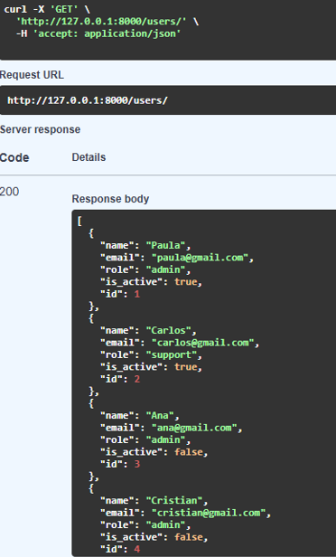
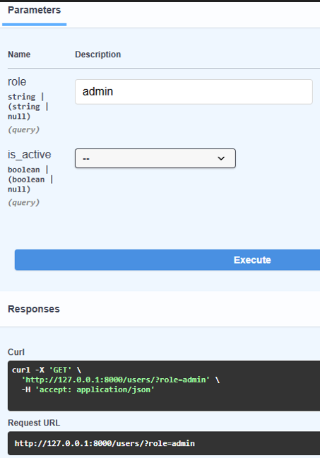
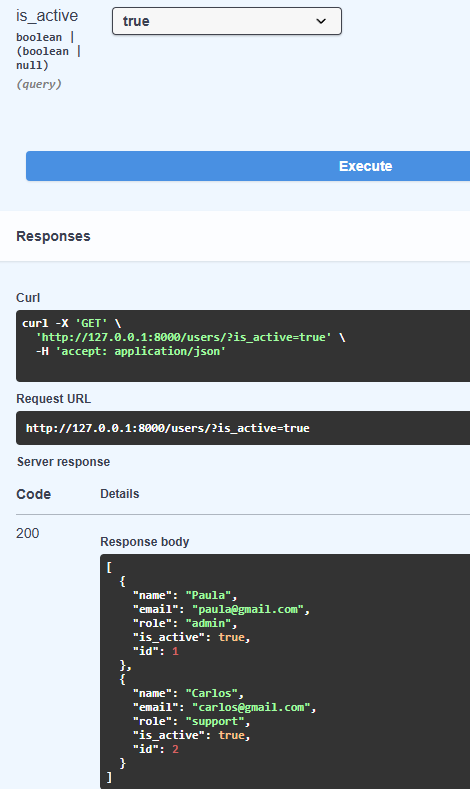
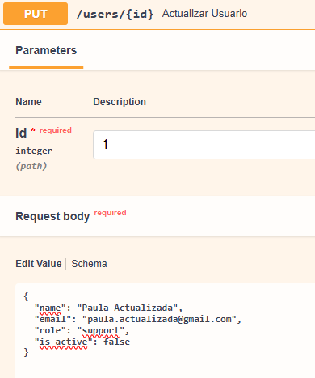
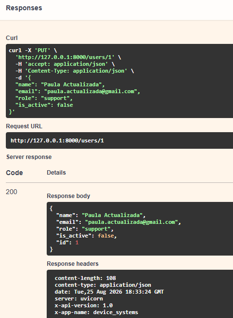

# API REST de Usuarios con FastAPI

## Descripción

Este proyecto consiste en el desarrollo de una API REST para la gestión de usuarios, construida utilizando Python y FastAPI.

La aplicación permite consultar, filtrar, registrar, actualizar y eliminar usuarios mediante diferentes endpoints HTTP.

Para el almacenamiento de información se utiliza SQLite junto con SQLAlchemy, permitiendo que los usuarios registrados permanezcan almacenados en una base de datos local (test.db) aunque la aplicación se reinicie.

El proyecto está estructurado de manera modular, separando las rutas de la API, los esquemas de validación, los modelos de base de datos y la configuración de la conexión.

---

## Tecnologías utilizadas

Python
FastAPI
Pydantic
SQLAlchemy
SQLite
Uvicorn
Swagger / OpenAPI

---

## Estructura del proyecto

```text
FastApi/ 
│ 
├── app/ 
│ ├── main.py 
│ ├── database.py 
│ │ 
│ ├── models/ 
│ │   └── usuario.py   
│ │ 
│ ├── routes/ 
│ |   └── user_routes.py 
| |
│ └── schemas/ 
│     └── user_schema.py 
|
├── Pruebas/ 
├── .gitignore 
├── README.md 
├── test.db 
└── venv/
```

### Descripción de los archivos

#### `app/main.py`

Es el archivo principal de la aplicación.

En este archivo se:

Crea la instancia de FastAPI.
Configura el nombre, descripción y versión de la API.
Importa el modelo de usuario.
Crea automáticamente las tablas de la base de datos.
Define un middleware HTTP.
Agregan las rutas de usuarios mediante include_router().

La creación de las tablas se realiza mediante: Base.metadata.create_all(bind=engine)


### `app/database.py`

Contiene la configuración de la conexión con la base de datos SQLite.

Se define:

La URL de conexión.
El motor de SQLAlchemy (engine).
La fábrica de sesiones (SessionLocal).
La clase base para los modelos (Base).

La base de datos utilizada es:

sqlite:///./test.db

Por lo tanto, el archivo test.db se encuentra en la raíz del proyecto.


#### `app/routes/user_routes.py`

Contiene los endpoints relacionados con la gestión de usuarios.

Las rutas utilizan SessionLocal para abrir sesiones con la base de datos y realizar operaciones de consulta, creación, actualización y eliminación.

También utiliza Depends() de FastAPI para administrar las sesiones de SQLAlchemy.


#### `app/schemas/user_schema.py`

Contiene los modelos Pydantic utilizados para validar la información recibida y enviada por la API.

Se utilizan:

* `BaseModel`
* `EmailStr`
* `Field`
* `Literal`


### `test.db`

Es la base de datos SQLite utilizada por la aplicación.

Dentro de ella se encuentra la tabla: usuarios

La tabla almacena los usuarios registrados mediante la API.


#### `.gitignore`

Define archivos y carpetas que no deben ser enviados al repositorio Git, como:

* Entornos virtuales.
* Caché de Python.
* Archivos `.env`.
* Configuraciones de IDE.
* Logs.

---

## Modelo de usuario

Los usuarios manejados por la API contienen los siguientes atributos:

| Campo       | Tipo    | Descripción                      |
| ----------- | ------- | -------------------------------- |
| `id`        | Integer | Identificador único del usuario  |
| `name`      | String  | Nombre del usuario               |
| `email`     | Email   | Correo electrónico               |
| `role`      | String  | Rol del usuario                  |
| `is_active` | Boolean | Indica si el usuario está activo |

Los roles permitidos son:

* `admin`
* `support`
* `user`

Además, el nombre debe contener como mínimo **3 caracteres**, el correo debe cumplir con un formato válido, el correo debe ser único, el rol debe pertenecer a los valores permitidos y is_active debe ser un valor booleano.

---


## Validaciones y restricciones

### Validaciones con Pydantic

La validación de los datos recibidos por la API se realiza mediante Pydantic.

El modelo UserBase establece las siguientes reglas:

class UserBase(BaseModel):

    name: str = Field(..., min_length=3)

    email: EmailStr

    role: Literal["admin", "support", "user"]

    is_active: bool

Esto permite garantizar que:

El nombre tenga mínimo 3 caracteres.
El correo tenga un formato válido.
El rol corresponda a uno de los valores permitidos.
is_active sea un valor booleano.

Cuando los datos no cumplen estas reglas, FastAPI devuelve automáticamente un error 422 Unprocessable Entity.


## Constraints en SQLAlchemy

El modelo Usuario utiliza diferentes restricciones para garantizar la integridad de los datos:

id = Column(Integer, primary_key=True, index=True)

name = Column(String, nullable=False)

email = Column(
    String,
    unique=True,
    nullable=False,
    index=True
)

role = Column(String, nullable=False)

is_active = Column(Boolean, nullable=False, default=True)
nullable=False

Impide que los campos puedan almacenarse con un valor NULL en la base de datos.

Se aplica a:

name
email
role
is_active
unique=True

Se aplica al campo email y evita que existan dos usuarios con el mismo correo electrónico.

primary_key=True

Se utiliza en id para identificar de manera única cada usuario.

default=True

Establece True como valor predeterminado para is_active cuando no se especifica otro valor al crear el registro.


# Endpoints

Todos los endpoints relacionados con usuarios utilizan el prefijo:

```text
/users
```

---

## 1. Obtener todos los usuarios

### Método

```http
GET /users/
```

Obtiene todos los usuarios registrados.

### Ejemplo

```http
GET http://127.0.0.1:8000/users/
```

### Respuesta

```json
[
    {
        "id": 1,
        "name": "Paula",
        "email": "paula@gmail.com",
        "role": "admin",
        "is_active": true
    }
]
```

Si no existen usuarios, la API devuelve:

{
    "detail": "No se encontraron usuarios"
}

con código: 404 Not Found

---

## 2. Filtrar usuarios por rol

### Método

```http
GET /users/?role=admin
```

Permite obtener únicamente los usuarios que tengan un determinado rol.

### Roles disponibles

```text
admin
support
user
```

### Ejemplo

```http
GET /users/?role=admin
```

---

## 3. Filtrar usuarios por estado

También es posible filtrar los usuarios mediante el parámetro `is_active`.

### Usuarios activos

```http
GET /users/?is_active=true
```

### Usuarios inactivos

```http
GET /users/?is_active=false
```

---

## 4. Combinar filtros

Los parámetros pueden utilizarse simultáneamente.

Por ejemplo:

```http
GET /users/?role=admin&is_active=true
```

Esta consulta devuelve únicamente los usuarios que:

* Tienen el rol `admin`.
* Se encuentran activos.

---


## 5. Obtener un usuario por ID

### Método

```http
GET /users/{id}
```

Permite consultar un usuario específico utilizando su identificador.

### Ejemplo

```http
GET /users/1
```

### Respuesta

```json
{
    "id": 1,
    "name": "Paula",
    "email": "paula@gmail.com",
    "role": "admin",
    "is_active": true
}
```

Si el ID no existe, la API devuelve:

```json
{
    "detail": "Usuario no encontrado"
}
```

con código HTTP:

```text
404 Not Found
```

---

## 6. Crear un usuario

### Método

```http
POST /users/
```

Permite registrar un nuevo usuario.

### Body

```json
{
    "name": "Laura",
    "email": "laura@gmail.com",
    "role": "user",
    "is_active": true
}
```

### Respuesta

La API genera automáticamente el ID del nuevo usuario.

```json
{
    "id": 5,
    "name": "Laura",
    "email": "laura@gmail.com",
    "role": "user",
    "is_active": true
}
```

El código de respuesta es:

```text
201 Created
```

---

## 7. Actualizar un usuario con PUT

### Metodo 

```http
PUT /users/{id}
```

permite actualizar los datos completos de un usuario existente.

### Body

```json
{
    "name": "Paula Actualizada",
    "email": "paula.actualizada@gmail.com",
    "role": "support",
    "is_active": false
}
```

## Respuesta

```json
{
    "id": 1,
    "name": "Paula Actualizada",
    "email": "paula.actualizada@gmail.com",
    "role": "support",
    "is_active": false
}
```

El código de respuesta es:

```text
200 ok 
```

Si el usuario no existe la API devuelve:

```json
{
     "detail": "Usuario no encontrado"
}
```

Con código:

```text
404 Not Found
```

---

## 8. Actualizar parcialmente un usuario con PATCH

Permite enviar únicamente los campos que se desean modificar. Los demás datos permanecen sin cambios.

### Metodo 

```http 
PATCH /users/{id}
```

## Body 

```json 
{
    "name": "Carlos Actualizado"
}
```

## Respuesta

```json 
{
    "id": 2,
    "name": "Carlos Actualizado",
    "email": "carlos@gmail.com",
    "role": "support",
    "is_active": true
}
```

El código de respuesta es:

```text
200 ok 
```

Si el usuario no existe, la API devuelve:

```json 
{
    "detail": "Usuario no encontrado"
}
```

Con código:

```text
404 Not Found
```

---

### 9. Eliminar un usuario con DELETE

permite eliminar un usuario de la base de datos temporal.

## Metodo 

```http 
DELETE /users/{id}
```

```http 
DELETE /users/4
```

## Respuesta 

```json 
{
    "message": "Usuario eliminado correctamente"
}
```

El código de respuesta es: 

```text 
200 OK
```
---

## Diferencia entre PUT y PATCH

| Método |                 Fucion                   |
|--------|------------------------------------------|
|  PUT	 | Actualiza todos los datos del usuario    |
| PATCH	 | Actualiza únicamente los campos enviados |

---

# Manejo de errores

La API implementa diferentes códigos de estado HTTP para informar el resultado de las operaciones.

| Código | Significado                         |
| ------ | ----------------------------------- |
| `200`  | Solicitud procesada correctamente   |
| `201`  | Usuario creado correctamente        |
| `400`  | Datos no válidos o correo duplicado |
| `404`  | Recurso no encontrado               |
| `422`  | Error de validación de datos        |


### Usuario inexistente

```json
{
    "detail": "Usuario no encontrado"
}
```

### Correo duplicado

Si se intenta registrar un usuario con un correo que ya existe:

```json
{
    "detail": "El correo electrónico ya está registrado"
}
```

---

# Datos inválidos

Cuando los datos enviados no cumplen las validaciones de Pydantic, FastAPI devuelve:

422 Unprocessable Entity

Por ejemplo:

Nombre con menos de 3 caracteres.
Correo electrónico inválido.
Rol no permitido.
Tipo de dato incorrecto.

---

## Base de datos

El proyecto utiliza SQLite como sistema de almacenamiento y SQLAlchemy como ORM.

La configuración de la base de datos se encuentra en:

app/database.py

La URL utilizada es:

SQLALCHEMY_DATABASE_URL = "sqlite:///./test.db"

Esto permite trabajar con una base de datos local llamada:

test.db

Dentro de la base de datos se encuentra la tabla:

usuarios

Las tablas se crean automáticamente mediante:

Base.metadata.create_all(bind=engine)

De esta manera, no es necesario crear manualmente la tabla usuarios.

---

## Sesiones con SQLAlchemy

Para realizar las operaciones sobre la base de datos se utiliza SessionLocal.

La aplicación obtiene una sesión mediante una dependencia de FastAPI:

def get_db():
    db = SessionLocal()
    try:
        yield db
    finally:
        db.close()

Esto permite:

Abrir una sesión con la base de datos.
Utilizar la sesión dentro del endpoint.
Cerrar la sesión cuando termina la petición.

Por ejemplo, para consultar usuarios se utiliza:

db.query(Usuario).all()

Para guardar un usuario:

db.add(nuevo_usuario)
db.commit()
db.refresh(nuevo_usuario)

---

##Swagger / OpenAPI

FastAPI genera automáticamente la documentación de la API utilizando Swagger UI y OpenAPI.

La documentación interactiva puede consultarse en:

http://127.0.0.1:8000/docs

Desde Swagger se pueden probar directamente los endpoints:

GET
POST
PUT
PATCH
DELETE

También se puede consultar el documento OpenAPI en:

http://127.0.0.1:8000/openapi.json

---

## Middleware

El proyecto incluye un middleware HTTP en main.py.

Este middleware agrega automáticamente dos cabeceras a las respuestas:

X-App-Name: device_systems
X-API-Version: 1.0

Estas cabeceras permiten identificar la aplicación y la versión de la API.

---

# Pruebas

## Crear usuario




## Validación de error: nombre con caracteres insuficientes




## Validacion de error: rol incorrecto


## Validacion de error: Correo inavlido


## Validacion de error: correo duplicado

Agregamos un nuevo usuario




Ejecutamos nuevamente sin cambiar los aparemtros iniciales para comprobar que no se duplique


## Prueba del Get sin ingresar rol ni estado 




## Prueba de Get con rol




## Prueba de Get con estado




## Prueba de Get con estado y rol


## Cabeceras HTTP 


## Obtener usuario por ID


## Prueba de Put: actualizar usuario





## Prueba del Patch: actualizar nombre


## Prueba de Delete


---


# Autor

Aprendiz: Maylee Gómez Yarce

Ficha: 3223877

Python FastApi

Tecnologo en analisis y desarrollo de software ADSO

CTMA - SENA

---